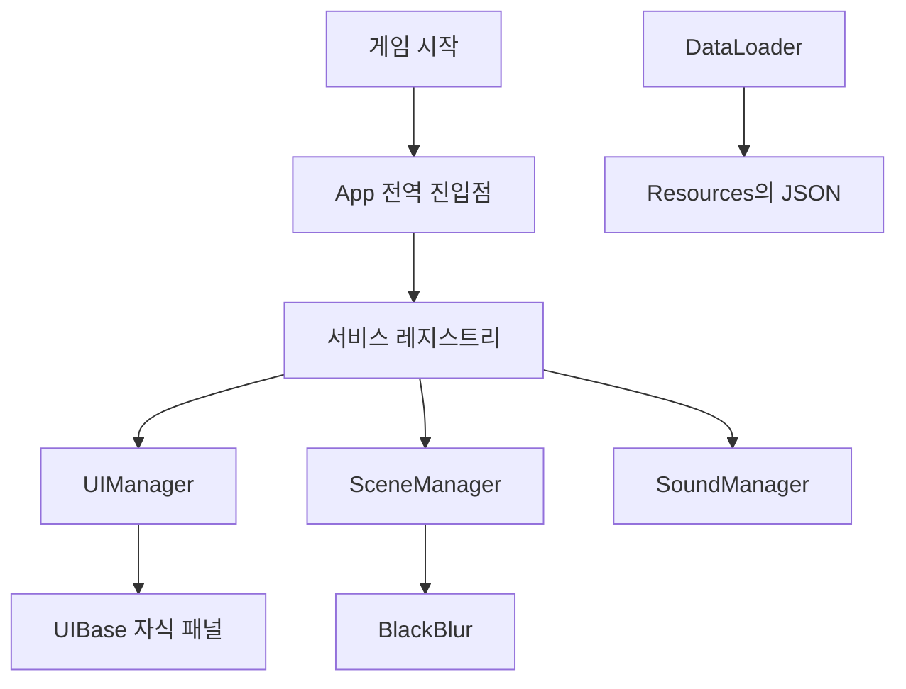

# 프로젝트 시작하기

## 프로젝트 실행

1. Unity에서 프로젝트를 엽니다.
2. 시작 씬을 엽니다.
3. Play 버튼을 누릅니다.

시작 씬의 이름과 위치는 사전에 정한 기준에 맞게 아래에 적어둡니다.

```text
시작 씬:
Assets/01. Scenes/00. Developer.unity
```

## 프로젝트의 주요 구조



현재 프로젝트에서는 여러 시스템을 `App`을 통해 가져올 수 있습니다.

예를 들어 사운드 기능이 필요할 때는 다음처럼 사용합니다.

```csharp
var sound = App.Get<SoundManager>();
sound.PlaySFX("Click");
```

`App`이 직접 모든 기능을 실행하는 것은 아닙니다.

```text
App
→ 필요한 시스템을 찾아주는 역할

SoundManager
→ 사운드를 재생하는 역할

다른 Manager
→ 각자 맡은 기능을 처리
```
