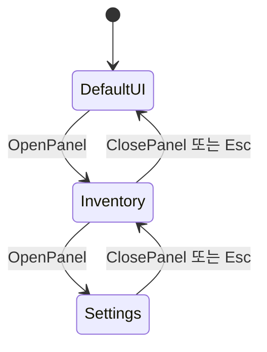

# UIManager와 UIBase 사용법

이 문서는 새로운 UI를 만들거나, 화면에 UI를 표시할 때 확인합니다.

```text
UI를 열고 싶다
→ UIManager 사용

새로운 UI 화면을 만들고 싶다
→ UIBase를 상속

UI가 제대로 열리지 않는다
→ 문서 아래쪽의 확인 사항 참고
```

## UIManager는 무엇인가요?



`UIManager`는 게임에 있는 여러 UI를 관리합니다.

예를 들면 다음과 같은 작업을 담당합니다.

```text
설정창 열기
인벤토리 열기
팝업 닫기
현재 열려 있는 UI 확인하기
```

각 코드에서 UI 오브젝트를 직접 찾는 대신, `UIManager`를 통해 UI를 열고 닫습니다.

## UIManager 가져오기

`UIManager`가 `AppService`를 상속하고 있으므로 다음처럼 가져옵니다.

```csharp
var uiManager = App.Get<UIManager>();
```

한 줄로 바로 사용할 수도 있습니다.

```csharp
App.Get<UIManager>();
```

다만 같은 함수 안에서 여러 번 사용할 때는 변수에 저장하는 편이 읽기 쉽습니다.

```csharp
var uiManager = App.Get<UIManager>();

// 이후 uiManager 사용
```

## UI 열기

다음과 같은 형태로 사용합니다.

```csharp
var uiManager = App.Get<UIManager>();

uiManager.GetPanel<InventoryUI>().OpenPanel();
```

또는 UI 이름을 사용하는 구조라면 다음과 같이 호출합니다.

```csharp
var inventory = uiManager.GetPanel<InventoryUI>();
inventory.OpenPanel();
```

## UI 닫기

UI를 닫는 방법도 프로젝트 구조에 따라 다를 수 있습니다.

예시:

```csharp
var uiManager = App.Get<UIManager>();

uiManager.GetPanel<InventoryUI>().ClosePanel();
```

버튼에서 닫기 기능을 연결할 때는 다음처럼 사용할 수 있습니다.

```csharp
public void OnClickClose()
{
    App.Get<UIManager>().GetPanel<InventoryUI>().ClosePanel();
}
```

## UIBase는 무엇인가요?

`UIBase`는 여러 UI가 공통으로 사용하는 부모 클래스입니다.

예를 들어 다음 UI들이 있다고 가정합니다.

```text
InventoryUI
SettingUI
PauseUI
ConfirmPopup
```

각 UI마다 열기와 닫기 코드를 따로 작성하면 같은 코드가 반복됩니다.

그래서 공통 기능을 `UIBase`에 넣습니다.

```csharp
public class InventoryUI : UIBase
{
}
```

```csharp
public class SettingUI : UIBase
{
}
```

이렇게 하면 각 UI가 `UIBase`의 공통 기능을 사용할 수 있습니다.

## 새로운 UI 만들기

예를 들어 설정 화면을 만든다고 가정합니다.

### 1. UI 스크립트 만들기

```csharp
public class SettingUI : UIBase
{
}
```

### 2. UI GameObject에 스크립트 추가하기

Unity에서 설정 화면 GameObject를 선택합니다.

그다음 `SettingUI` 컴포넌트를 추가합니다.

### 3. UIManager에 등록하기

```text
UI가 실행될 때 자동 등록
```

### 4. 코드에서 열기

```csharp
App.Get<UIManager>().GetPanel<SettingUI>();
```

## UIBase에 넣기 좋은 기능

다음 기능은 여러 UI에서 공통으로 사용할 가능성이 높습니다.

```text
UI 열기
UI 닫기
처음 열릴 때 실행할 내용
닫힐 때 실행할 내용
버튼 입력 막기
UI 애니메이션
```

하지만 모든 기능을 처음부터 넣을 필요는 없습니다.

여러 UI에서 같은 코드가 반복될 때만 `UIBase`로 옮기는 편이 좋습니다.

## 각 UI 클래스에 넣기 좋은 기능

해당 UI에서만 사용하는 기능은 각 UI 클래스에 작성합니다.

예를 들어 `InventoryUI`라면 다음 기능이 들어갈 수 있습니다.

```text
아이템 목록 표시
선택한 아이템 정보 표시
아이템 사용 버튼 처리
```

```csharp
public class InventoryUI : UIBase
{
    public void RefreshItems()
    {
        // 아이템 목록 갱신
    }

    public void OnClickUseItem()
    {
        // 선택한 아이템 사용
    }
}
```

## UI를 만들 때 확인할 점

UI가 열리지 않는다면 다음 순서로 확인합니다.

1. UI 스크립트가 `UIBase`를 상속했는지
2. UI GameObject에 스크립트가 붙어 있는지
3. UIManager에 UI가 등록되어 있는지
4. Canvas 아래에 UI가 있는지
5. UI가 다른 화면 뒤에 가려져 있지 않은지

## 작성 기준

UIManager와 UIBase의 역할은 다음처럼 나누는 것이 좋습니다.

```text
UIManager
→ 어떤 UI를 열고 닫을지 관리

UIBase
→ 모든 UI가 공통으로 사용하는 기능

InventoryUI, SettingUI 등
→ 해당 화면에서만 사용하는 기능
```

---

[README로 돌아가기](../README.md)
